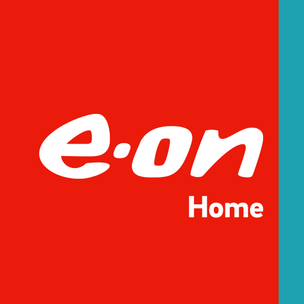

  

<h1 align="center">E.ON Next Home</h1>
<h3 align="center">Home Assistant Integration</h3>

  
  
  
  

---

> [!WARNING]
> This integration uses the **private E.ON Next / Kraken API**, reverse-engineered from the E.ON Next Home mobile app. It is not officially supported or endorsed by E.ON Next. It may break without warning if E.ON Next updates their app or API.

> [!NOTE]
> E.ON Next's smart charging backend is built on [Octopus Energy's Kraken platform](https://kraken.tech) — the same technology behind Intelligent Octopus Go. This integration currently covers **EV smart charging**. Solar and energy management support may be added in future.

---

## Features

### 🔋 Sensors

| Entity | Description | Category |
|--------|-------------|----------|
| Smart Charge Status | Device registration status (`Live` / `Suspended`) | — |
| Vehicle | Your registered EV name (e.g. Audi Q4 e-tron) | Diagnostic |
| Smart Charge Window Start | Start time of the next planned charging window | — |
| Smart Charge Window End | End time of the last planned charging window | — |
| Smart Charge Energy | Total kWh planned for the upcoming session | — |
| Weekday Target Charge | Weekday target state of charge (%) | Diagnostic |
| Weekend Target Charge | Weekend target state of charge (%) | Diagnostic |
| Weekday Ready By | Weekday target ready-by time | Diagnostic |
| Weekend Ready By | Weekend target ready-by time | Diagnostic |
| Battery Capacity | Vehicle battery size (kWh) | Diagnostic |
| Charger Max Power | Charger rated power (kW) | Diagnostic |

### 💡 Binary Sensors

| Entity | Description |
|--------|-------------|
| Charger Connected | OCPP connection status of the smart charger |
| Smart Charging Scheduled | Whether dispatch windows are currently planned |
| Smart Charge Device Active | Whether the Kraken device is registered and live |

### 🔘 Switches

| Entity | Description |
|--------|-------------|
| Smart Charging | Enable or suspend Kraken smart charge scheduling |
| Boost Charge | Start or cancel an immediate full-rate charge |

---

## Installation

### Via HACS (Recommended)

1. Open **HACS** in Home Assistant
2. Go to **Integrations**
3. Click the **⋮** menu → **Custom repositories**
4. Enter this repository URL and set the category to **Integration**
5. Click **Add**, then find and click **Download** on the E.ON Next Home card
6. Restart Home Assistant

### Manual

1. Download this repository as a ZIP and extract it
2. Copy the `custom_components/eon_next_home/` folder into your HA config directory at `config/custom_components/eon_next_home/`
3. Restart Home Assistant

---

## Setup

1. Go to **Settings → Devices & Services → Add Integration**
2. Search for **E.ON Next Home**
3. Enter your E.ON Next account **email** and **password**
4. Click **Submit** — the integration will authenticate and discover your account

> Your credentials are stored locally in Home Assistant's encrypted config store and are only used to authenticate with the E.ON Next API.

---

## Requirements

- An E.ON Next account with an EV registered for smart charging
- A compatible smart charger connected to the E.ON Next Home app (e.g. Ohme Home Pro)
- Home Assistant **2023.1** or newer

---

## How it works

- Data is polled every **5 minutes** via the Kraken GraphQL API (`api.eonnext-kraken.energy`)
- Authentication uses short-lived JWT access tokens (1 hour) which are refreshed automatically using a long-lived refresh token (≈6 months)
- If the refresh token expires, Home Assistant will prompt you to re-enter your credentials
- All API calls are made over HTTPS

---

## Contributions

Pull requests are welcome. If you find a bug or want to request a feature (e.g. gas usage, solar, tariff data), please open an [issue](https://github.com/callumeveratt/ha-eon-next-home/issues).

---

## Disclaimer

This project is not affiliated with, endorsed by, or officially connected to E.ON Next or Octopus Energy. Use at your own risk.
